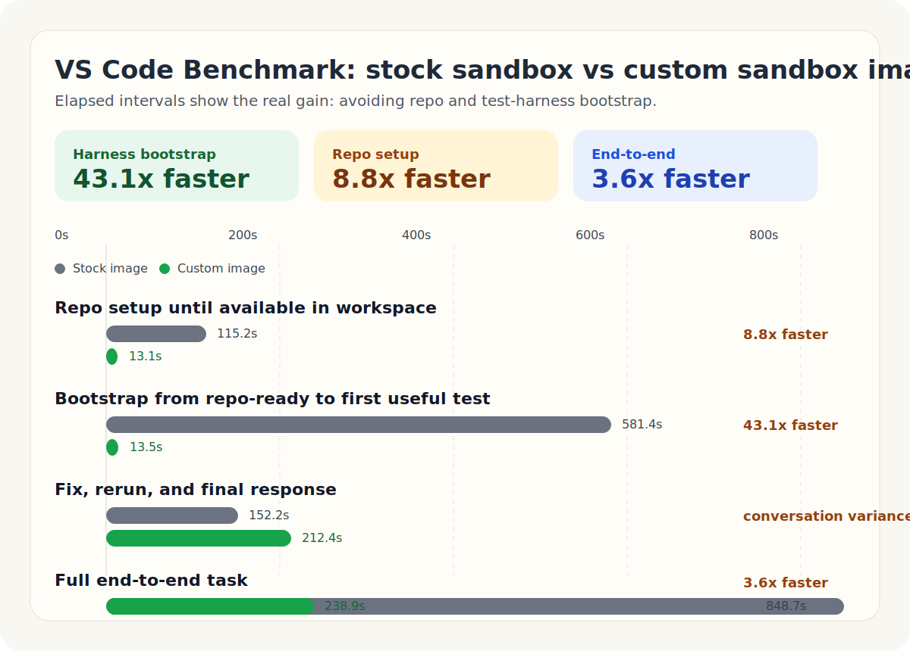

# OpenHands Custom Sandbox Images

Custom sandbox images let you preload the repo, dependencies, docs, and test harness your agent needs, so your agent starts the task instead of spending minutes provisioning a workspace.



## Why use a custom image

- `Faster path to useful work`
  The agent can reach the real task quickly instead of burning time on clone, install, transpile, and bootstrap steps.
- `Easier monorepo workflows`
  Repo checkout, dependencies, transpiled output, and helper tooling can already be present.
- `Easier complex test harness workflows`
  Native packages, headless browser support, Electron artifacts, and org-specific wrappers can be prebaked.
- `Lower setup variance and better reliability`
  Each run does not need to rediscover the same bootstrap steps, which reduces stalls, OOMs, and half-finished setup.

## Published benchmark

This repo includes a public VS Code benchmark where the agent fixes a bug and validates it with a real test suite.

Biggest results:

- `26.3x` faster to first useful test output
- `43.1x` faster harness bootstrap after repo access
- `3.6x` faster end to end

| Metric | Stock image | Custom image | Speedup |
| --- | ---: | ---: | ---: |
| Repo available in workspace | `115.2s` | `13.1s` | `8.8x` |
| First targeted test output | `696.5s` | `26.5s` | `26.3x` |
| Bootstrap after repo access, before first useful test | `581.4s` | `13.5s` | `43.1x` |
| End-to-end task completion | `848.7s` | `238.9s` | `3.6x` |

What these metrics mean:

- `Repo available in workspace`
  The repo exists and is accessible where the agent expects to work.

- `First targeted test output`
  The agent has reached the exact requested verification command and received useful output from it.

- `Bootstrap after repo access`
  The setup gap between "repo exists" and "the real test is running."

- `End-to-end task completion`
  Full task span, including setup, diagnosis, edits, reruns, and final summary.

### What the results mean

The biggest win is not raw clone speed. The main bottleneck was getting the environment and test harness into a runnable state.

In the completed stock run, the expensive setup looked roughly like this:

- clone and checkout: about `115s`
- `npm install`: about `525s`
- transpile: about `28s`
- Electron prep: about `5s`

Once both environments were ready, the actual bug-fix loop was much smaller than the cold-start setup tax. That is the real value of a custom sandbox image: less environment assembly, faster verification, and more reliable agent runs.

## Build your own custom image

Canonical OpenHands sandbox image guide:

- https://docs.openhands.dev/sdk/guides/agent-server/docker-sandbox

The basic pattern is:

1. Start from the OpenHands agent-server base image.
2. Keep the normal OpenHands entrypoint intact.
3. Add your repo, docs, tools, and verification wrappers.
4. Pre-run the expensive setup you do not want to repeat at task time.
5. Publish the image to a registry and point Replicated at it.

The base image used here is:

```dockerfile
FROM ghcr.io/openhands/agent-server:1.23.0-python
```

Important rule:

- preserve normal OpenHands agent-server behavior
- extend the image; do not replace the runtime contract with a custom entrypoint

### Example: VS Code benchmark image

Build and push an amd64 image:

```bash
docker buildx build \
  --platform linux/amd64 \
  -f vscode-benchmark/Dockerfile \
  -t ghcr.io/<owner>/openhands-custom-image:vscode-benchmark \
  --push \
  .
```

That image prebakes:

- pinned repo checkout
- `node_modules`
- transpiled output
- Electron artifacts
- native packages such as `xvfb`, `libkrb5-dev`, `pkg-config`, `libx11-dev`, and `libxkbfile-dev`
- repo-local verification wrappers

## Configure Replicated VM Installer

In the Replicated installer, set:

- `Use a Custom Sandbox Image`: on
- `Sandbox Image Repository`: your image repository
- `Sandbox Image Tag`: your tag
- `Registry Server`: if required
- `Registry Username`: if required
- `Registry Password or Credentials`: if required

This feature is specifically for the sandbox / agent-server image, not every OpenHands service image.

## Reproduce the VS Code benchmark

### Stock image run

Use the stock sandbox image and this prompt:

```text
Clone https://github.com/rajshah4/vscode-benchmark-repo.git into /workspace/project/vscode-benchmark, checkout branch openhands-benchmark-01, and work there.

Do not guess at bootstrap steps. Run the repo-local bootstrap helper first:

./scripts/openhands-stock-bootstrap.sh

If progress is unclear or something seems stuck, check:

./scripts/openhands-benchmark-status.sh

After bootstrap finishes, run:

./scripts/openhands-benchmark-verify.sh

Then fix the bug in:
src/vs/platform/configuration/common/configurationModels.ts

Rerun ./scripts/openhands-benchmark-verify.sh until it passes.

Before you finish, summarize:
- what bootstrap/setup work was required before the first useful test output
- what code change fixed the bug
- what setup steps were most expensive or fragile
```

### Custom image run

Use the custom sandbox image and this prompt:

```text
Start by running prepare-vscode-benchmark. Then work in /workspace/vscode-benchmark.

Run the verification command first:

vscode-benchmark-verify

Then fix the bug in:
src/vs/platform/configuration/common/configurationModels.ts

Rerun vscode-benchmark-verify until it passes.

Before you finish, summarize which setup steps were already handled by the custom image.
```

### Analyze conversation exports

```bash
python3 benchmarks/analyze_conversation_export.py /path/to/conversation_export --show-events
```

That lets you compare:

- time to repo-ready state
- time to first useful test
- time to passing verification
- total conversation span
